# Net Practice

Created: July 30, 2022 11:14 AM
Tags: Network, School

> Project Status:  in progress.
> 

<aside>
💡 Net-practice is a school project about networking, where we have to configure small-scale networks, the project has 10 levels, and every level is more complicated than the other, this project is a system Administration related exercise.

</aside>

---

### What is TCP/IP?

- TCP stands for Transmission Control Protocol
- IP stands for Internet Protocol

### But What exactly is TCP/IP?

- TCP/IP was built to help us to determine how a specific computer should be connected to the internet and how data should be transmitted between them, The purpose is to allow communication over large distances.
- An IP address is an identifier for a computer or a device on the network, every device has to have an IP address for communication purposes, An IP address consists of 2 parts: a network address and a host address, there are two versions of IP address IPv4 and IPv6:

---

- IPv4: is the current version of the IP address, it has a 32-bit numeric address written as four numbers separated by dots called octets, the number range for every octet is from 0 to 255, this address version can produce over 4 billion unique addresses, computers and networks don’t read IP addresses in his standard numeric format, they only understand numbers in a binary format.
    - IPv4 binary conversion
        - Here is the 8-bit chart that we use to get a possible valid IP address
            
            
            | 128 | 64 | 32 | 16 | 8 | 4 | 2 | 1 |
            | --- | --- | --- | --- | --- | --- | --- | --- |
            
            <aside>
            💡 for example, if we take a random IP address like:
            
            `134.2.101.245` his binary format is: 
            `10000110. 00000010. 01100101. 11110101`
            
            </aside>
            
            now how we did do this?
            
            - to convert the IP address we will take that string of numbers and start from left to right, for each value we see if we can subtract this value from the decimal remaining if we can’t, we put “0” under the binary value, if its the opposite And the answer is Yes we put “1” under the binary value.
            - We take IP address 134.2.101.245 to convert to binary we start with the first part “134”
                - The Question: Can I subtract “128” from “134” → YES! so put “1” to 128
                    
                    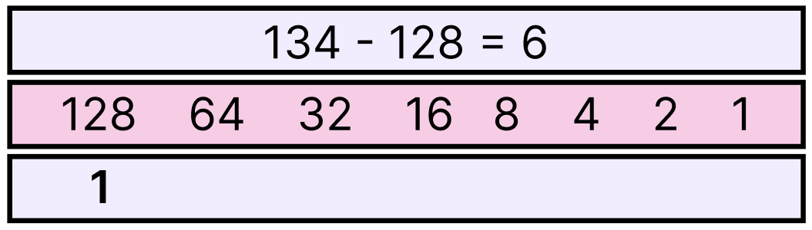
                    
                - The Question: Can I subtract “64” from “6” → NO! so put “0” to 64
                    
                    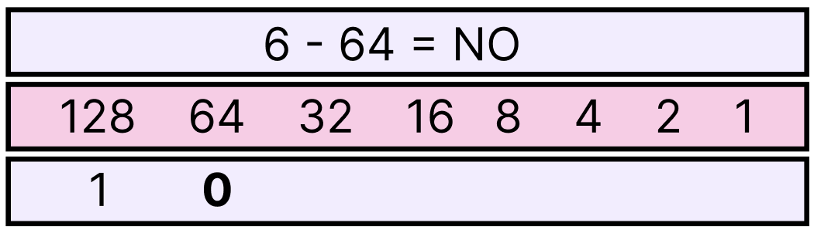
                    
                - The Question: Can I subtract “32” from “6” → NO! so put “0” to 32
                    
                    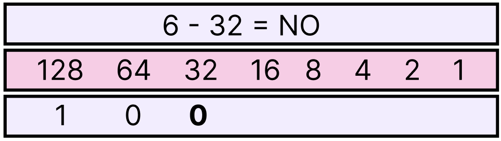
                    
                - The Question: Can I subtract “16” from “6” → NO! so put “0” to 16
                    
                    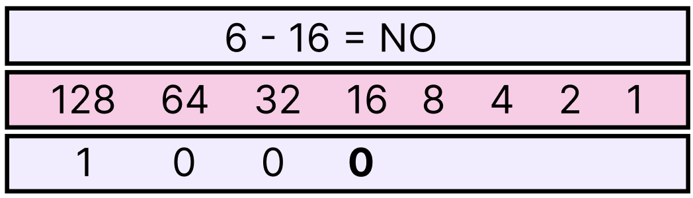
                    
                - The Question: Can I subtract “8” from “6” → NO! so put “0” to 8
                    
                    
                    
                - The Question: Can I subtract “4” from “6” → Yes! so put “1” to 4
                    
                    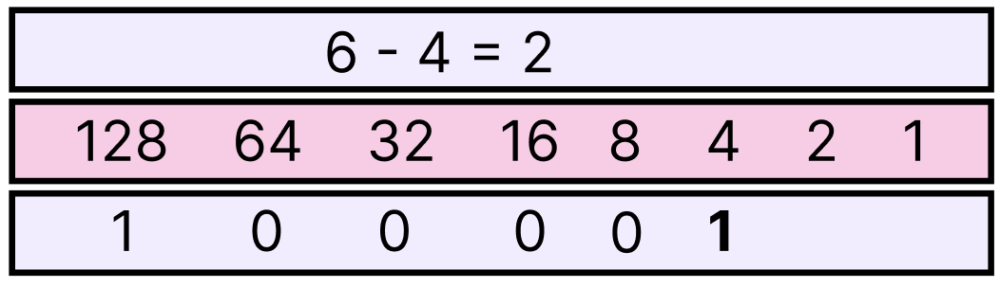
                    
                - The Question: Can I subtract “2” from “2” → NO! so put “1” to 2
                    
                    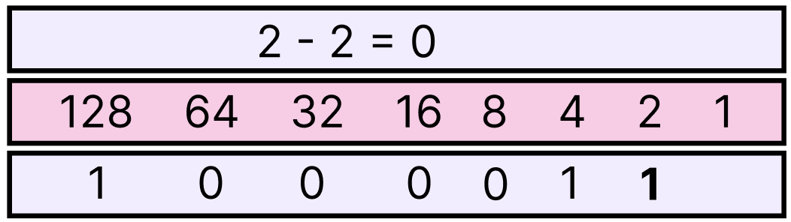
                    
                - The Question: Can I subtract “1” from “0” → NO! so put “.0” to 1
                    
                    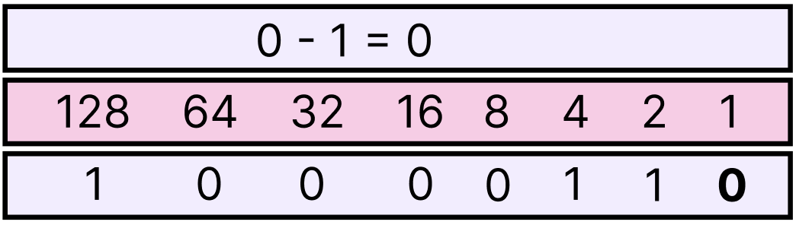
                    
                - The first part of The IP address 134 is 10000110 in binary so we repeat the same way with the other parts of The IP address.
                    - [Source for more Explanation](https://petri.com/csc_convert_ip_address_from_decimal_to_binary/)
    
    ---
    
- IPv6: is the next generation of IP addresses, it has a 128-bit hexadecimal address, with this type of address IPv6 can produce over 340 undecillion addresses, it is made up of 8 sets of 16 bits, the 8 sets separated by a colon
    - IPv6 binary conversion
        - Here is the 4-bit chart that we use to get a possible valid IP address
            
            
            | 8 | 4 | 2 | 1 |
            | --- | --- | --- | --- |
            
            The possible character is from `0 to 9` and from `A to F`
            
            <aside>
            💡 for example, if we take random IPv6 Addresses like:
            f145:4455:447e:fc46:06a0:a1d3:b03b:c24f
            his binary would be :
            `1111000101000101 0100010001010101 0100010001111110 1111110001000110 0000011010100000 1010000111010011 1011000000111011 1100001001001111`
            
            </aside>
            
            now how we did do this?
            
            - first of all, we cannot use a double-digit number to represent 4 bits in hexadecimal, double-digit numbers are represented with a single alphabet (A-F), Each hexadecimal character represents 4 bits.
            - Now I can't break and convert all sets of this IP Address because of three things Version 6 of IP addresses is too long and  I'm lazy and finally their tons of websites and applications that can do that for us. but for knowledge, we gonna convert the first set only and you can repeat the same way with all other sets:
                - The first set is **`f145` so let's start with the first 4-bits,`f`** equal to $15$ in hexadecimal which means:
                    
                    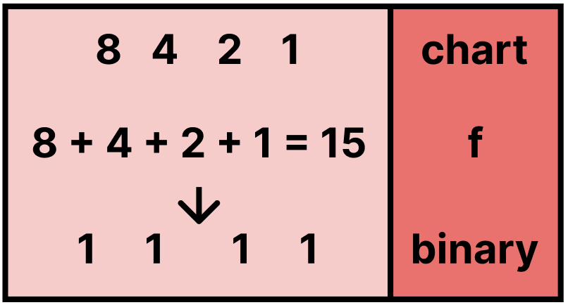
                    
                    ~ so `**f**` is `1111`in binary
                    
                - Now let go to the second 4-bits, `**1` is $1$ in hexadecimal, which means xD:**
                    
                    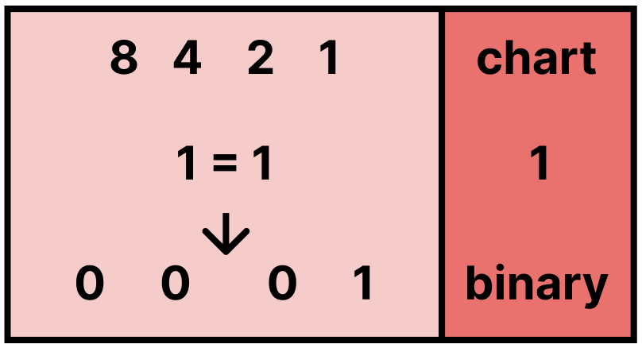
                    
                    ~ so **`1`** is `0001` in binary
                    
                - Now let go to the 3rd 4-bits, **`4` is $4$ in hexadecimal, which means xD xD:**
                    
                    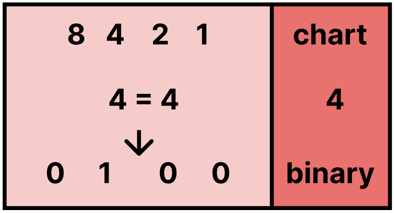
                    
                    ~ so **`4`** is `0100` in binary
                    
                - Now let go to the last 4-bits in this set, **`5` is $5$ in hexadecimal, which means -_-:**
                    
                    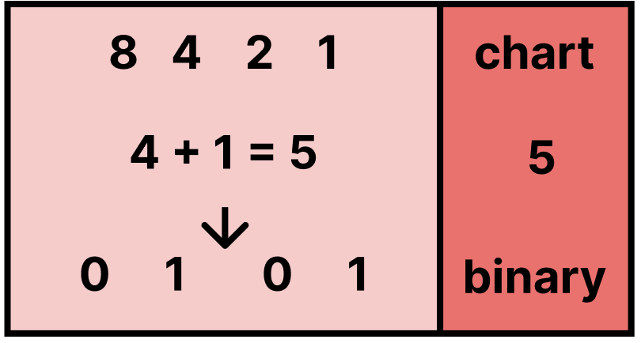
                    
                    ~ so **`5`** is `0101` in binary
                    
                - So the binary of the first set is all of them together `1111000101000101` now you can convert the other sets by yourself.
                    
                    
                    
    
    ---
